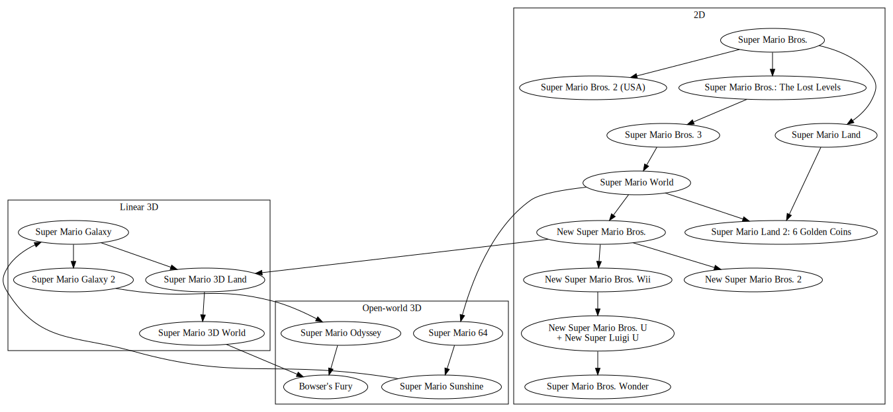

Super Mario games
===
I made this inspired by [this jan Misali video](https://www.youtube.com/watch?v=XejJ6PzPtEw) about how many Super Mario games there are. It is a surprisingly long video with tons of research into the topic of what counts as a Super Mario game. Below is my interpretation of the question, with an illustration of what I perceive as the lineage between the various games (with non-Mario games such as Doki Doki Panic not included even though they would be included in the lineage).

I consider the 2D and 3D games to be distinct groups, therfore the grouping on the graph. The linear 3D games (3D Land and 3D World) are a kind of mix of gameplay between the 2D and traditional 3D games so I also consider them to be their own small group.

For the more controversial cases:
* Remakes, including Super Mario 64 DS, are a version of the original game and not a separate game.
* New Super Luigi U is part of New Super Mario Bros. U.
* Bowser's Fury is a separate game despite it not existing as such, due to the major gameplay differences, as it fits more into the open world category rather than the linear one.

This results in a total of 19 games as of 2021.

